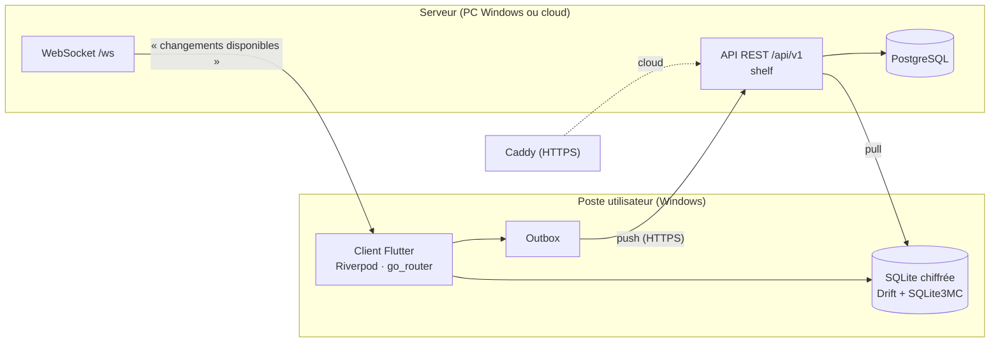
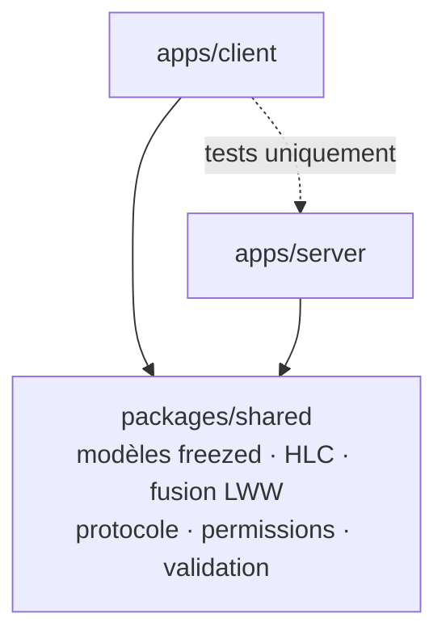
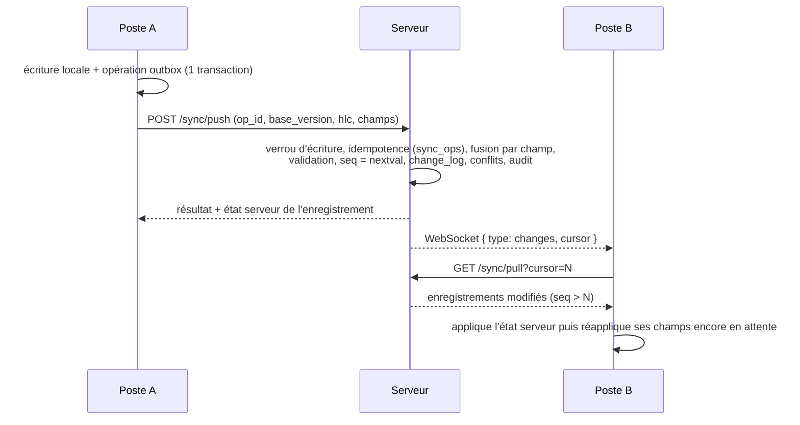

# Architecture — Voyaj CRM

## Vue d'ensemble



## Packages



| Package | Rôle |
|---|---|
| `voyaj_shared` | Seule source des modèles et règles partagées : `Tag`, DTO d'auth, protocole de synchro, `EntitySchema` (liste blanche des champs), `Hlc`, `mergeFields`, `Permission`/`SystemRole`, validation. |
| `voyaj_server` | CLI `voyaj_server` (`serve`, `migrate`, `create-admin`, `gen-key`, `audit-verify`), API REST, WebSocket, services (auth, utilisateurs, synchro, audit). |
| `voyaj_client` | Application desktop : design system, shell, base locale, moteur de synchro, écrans. |

## Synchronisation

### Principes

- **Identifiants** UUID v7 générés côté client (création hors ligne sans collision).
- **Horloge logique hybride (HLC)** par poste, persistée : arbitre les conflits sans dépendre de
  l'exactitude des horloges des PC. Une horloge distante en avance de plus d'une minute est refusée.
- **Last-write-wins par champ** : chaque enregistrement porte `field_meta` = pour chaque champ, le
  HLC, la version et l'auteur de la dernière écriture.
- **Suppression logique** : `deleted_at` est un champ synchronisé comme les autres.
- **Journal des conflits** : quand deux écritures concurrentes (aucune n'avait vu l'autre) touchent
  le même champ avec des valeurs différentes, la plus récente gagne et le conflit est enregistré
  (`sync_conflicts`), consultable dans l'écran Synchronisation.

### Flux



- Les écritures sont **sérialisées** par un verrou transactionnel : les numéros de séquence sont
  validés dans l'ordre, un client ne peut pas « sauter » un changement.
- Opérations refusées (`invalid`, `forbidden`) : retirées de l'outbox, inscrites dans
  `sync_errors` (visible dans l'écran Synchronisation), l'état serveur est rétabli localement.
- Reconnexion WebSocket avec délai croissant (1 s → 30 s) ; synchronisation de secours chaque minute.

## Schéma PostgreSQL (migration 0001)

| Table | Contenu |
|---|---|
| `users` | email (citext unique), nom, hash Argon2id, statut, secrets TOTP **chiffrés** (AES-256-GCM), dernier pas TOTP (anti-rejeu) |
| `user_recovery_codes` | codes de secours 2FA (hachés, usage unique) |
| `roles`, `role_permissions`, `user_roles` | RBAC `ressource.action` ; rôles système synchronisés avec le code au démarrage |
| `sessions` | poste, jetons d'accès / de rafraîchissement **hachés**, jeton précédent (détection de vol), expiration, révocation |
| `auth_challenges` | étape « code 2FA attendu » (5 min, 5 essais) |
| `audit_log` | journal en ajout seul, chaîné SHA-256 ; triggers refusant UPDATE/DELETE/TRUNCATE |
| `sync_ops` | opérations déjà traitées (idempotence) |
| `change_log` | historique de toutes les modifications (seq, champs, HLC, auteur, poste) |
| `sync_conflicts` | conflits (valeurs gagnante/perdante, HLC, auteurs, revue) |
| `tags` | entité synchronisée : `id, name, color, description` + `version, seq, field_meta, created_*, updated_*, deleted_at` |

Base locale Drift (client) : `tags` (même structure, `version` = dernière version serveur connue),
`outbox`, `sync_errors`, `key_values` (préférences, curseur, HLC, poste, vues de tableaux).

## Sécurité

- **Mots de passe** : Argon2id (19 Mio, 2 itérations par défaut), 12 caractères minimum,
  rehachage automatique si les paramètres sont renforcés.
- **Jetons** opaques (256 bits), stockés hachés ; accès 15 min, rafraîchissement 30 jours avec
  **rotation** ; réutilisation d'un ancien jeton hors délai de grâce → session révoquée.
- **Sessions révocables** immédiatement (vérifiées à chaque requête ; WebSocket fermé).
- **2FA TOTP** (RFC 6238, fenêtre ±30 s, anti-rejeu) + 10 codes de secours.
- **Limitation** des tentatives de connexion (10 / 15 min par email+IP) et de 2FA (5 par étape).
- **TLS obligatoire** hors localhost (certificat direct ou reverse proxy HTTPS).
- **Secrets au repos** chiffrés par la clé maître `VOYAJ_MASTER_KEY` (jamais dans le code).
- **Client** : base locale chiffrée (SQLite3 Multiple Ciphers), clé et jetons dans le coffre de
  l'OS (DPAPI sous Windows) ; données locales effacées si un autre utilisateur se connecte.
- **Journal d'audit** inaltérable (`voyaj_server audit-verify`).

## API (v1)

| Méthode | Chemin | Rôle |
|---|---|---|
| GET | `/health` | état et version |
| POST | `/api/v1/auth/login`, `/auth/mfa`, `/auth/refresh`, `/auth/logout` | connexion |
| GET | `/api/v1/auth/me`, `/auth/sessions` | profil, sessions |
| DELETE | `/api/v1/auth/sessions/{id}` | révoquer une session |
| POST | `/api/v1/auth/password`, `/auth/totp/setup`, `/totp/confirm`, `/totp/disable`, `/totp/recovery-codes` | compte et 2FA |
| GET/POST/PATCH | `/api/v1/users`, `/users/{id}`, POST `/users/{id}/revoke-sessions` | utilisateurs |
| GET/POST/PUT/DELETE | `/api/v1/roles`, `/roles/{id}` | rôles |
| POST / GET | `/api/v1/sync/push`, `/sync/pull?cursor=` | synchronisation |
| GET / POST | `/api/v1/sync/conflicts`, `/sync/conflicts/{id}/review` | conflits |
| GET | `/api/v1/audit?limit=&before=` | journal d'audit |
| WS | `/ws` | notifications temps réel (1er message : authentification) |

## Client : organisation du code

```
lib/app/            bootstrap, providers Riverpod, routeur, shell, palette de commandes
lib/core/           client API (renouvellement des jetons), coffre, formats
lib/data/           base Drift, moteur de synchro, horloge, adaptateurs d'entités
lib/design_system/  tokens, thème, composants, tableau de données
lib/features/       auth, tags, sync, settings, admin, dev (catalogue en debug)
lib/l10n/           fichiers ARB (fr)
```
